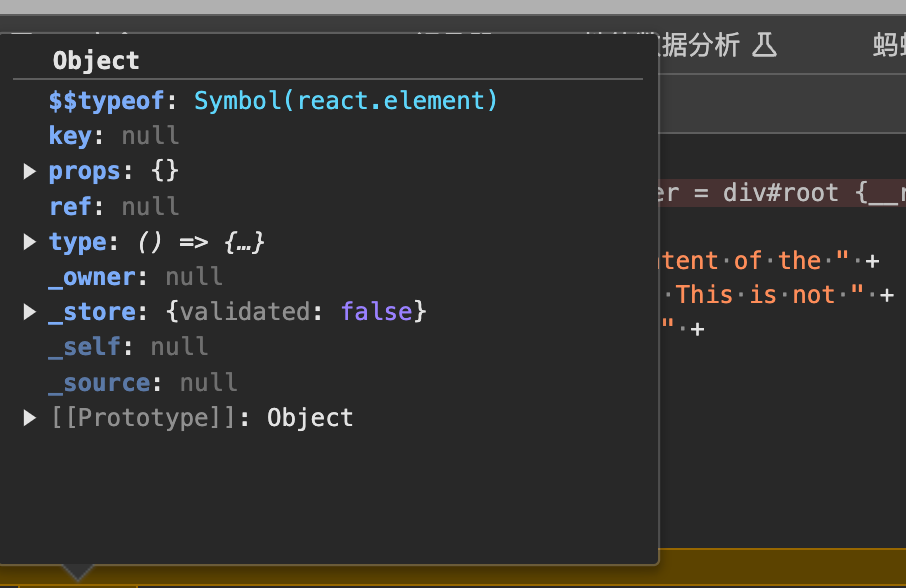
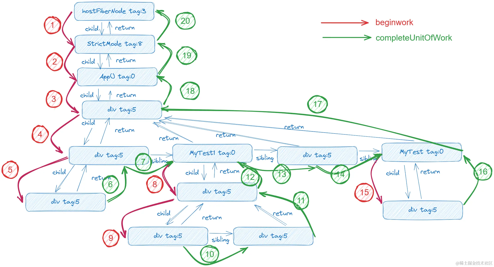

# 渲染流程

render

updateContainer(children, root, null, null);
children 是被 JSX 调用 React.createElement 之后的产物。

root 是之前创建的根 root

FiberRootNode 根的 FiberNode
FiberNode 通过 current 指向的 FiberNode

```js
var eventTime = requestEventTime();
var lane = requestUpdateLane(current$1);
```

获取赛道优先级和 eventTime

createUpdate 用于创建一个更新，可以看一下下面的源码

```js
function createUpdate(eventTime, lane) {
  var update = {
    eventTime: eventTime,
    lane: lane,
    tag: UpdateState,
    payload: null,
    callback: null,
    next: null,
  };
  return update;
}
```

创建出来了一个 update 对象，
下一步将 update.payload = {
element: element // 这个 element 是通过 JSX 解析后的虚拟 dom 对象

}

将此次更新入队

```js
function enqueueUpdate(fiber, update, lane) {
  var updateQueue = fiber.updateQueue;

  if (updateQueue === null) {
    // Only occurs if the fiber has been unmounted.
    return;
  }

  var sharedQueue = updateQueue.shared;

  if (isInterleavedUpdate(fiber)) {
    var interleaved = sharedQueue.interleaved;

    if (interleaved === null) {
      // This is the first update. Create a circular list.
      update.next = update; // At the end of the current render, this queue's interleaved updates will
      // be transferred to the pending queue.

      pushInterleavedQueue(sharedQueue);
    } else {
      update.next = interleaved.next;
      interleaved.next = update;
    }

    sharedQueue.interleaved = update;
  } else {
    var pending = sharedQueue.pending;

    if (pending === null) {
      // This is the first update. Create a circular list.
      update.next = update;
    } else {
      update.next = pending.next;
      pending.next = update;
    }

    sharedQueue.pending = update;
  }

  {
    if (
      currentlyProcessingQueue === sharedQueue &&
      !didWarnUpdateInsideUpdate
    ) {
      error(
        "An update (setState, replaceState, or forceUpdate) was scheduled " +
          "from inside an update function. Update functions should be pure, " +
          "with zero side-effects. Consider using componentDidUpdate or a " +
          "callback."
      );

      didWarnUpdateInsideUpdate = true;
    }
  }
}
```

对 update 赋值，然后用 scheduleUpdateOnFiber 开始调度。

```js
function checkForNestedUpdates() {
  if (nestedUpdateCount > NESTED_UPDATE_LIMIT) {
    nestedUpdateCount = 0;
    rootWithNestedUpdates = null;
    throw new Error(
      "Maximum update depth exceeded. This can happen when a component " +
        "repeatedly calls setState inside componentWillUpdate or " +
        "componentDidUpdate. React limits the number of nested updates to " +
        "prevent infinite loops."
    );
  }

  {
    if (nestedPassiveUpdateCount > NESTED_PASSIVE_UPDATE_LIMIT) {
      nestedPassiveUpdateCount = 0;

      error(
        "Maximum update depth exceeded. This can happen when a component " +
          "calls setState inside useEffect, but useEffect either doesn't " +
          "have a dependency array, or one of the dependencies changes on " +
          "every render."
      );
    }
  }
}
```

这个方法用于检查 React 更新次数是否超过 50 次(我们经常看到的错误提示。)

```js
function scheduleUpdateOnFiber() {
  /// ...
  ensureRootIsScheduled(root, eventTime);
  if (
    lane === SyncLane &&
    executionContext === NoContext &&
    (fiber.mode & ConcurrentMode) === NoMode && // Treat `act` as if it's inside `batchedUpdates`, even in legacy mode.
    !ReactCurrentActQueue$1.isBatchingLegacy
  ) {
    // Flush the synchronous work now, unless we're already working or inside
    // a batch. This is intentionally inside scheduleUpdateOnFiber instead of
    // scheduleCallbackForFiber to preserve the ability to schedule a callback
    // without immediately flushing it. We only do this for user-initiated
    // updates, to preserve historical behavior of legacy mode.
    resetRenderTimer();
    flushSyncCallbacksOnlyInLegacyMode();
  }
  /// ...
}
```

主要的核心就是调用了 ensureRootIsScheduled，可以看看他的逻辑

```js
newCallbackNode = scheduleCallback$1(
  schedulerPriorityLevel,
  performConcurrentWorkOnRoot.bind(null, root)
);
function performConcurrentWorkOnRoot(root, didTimeout) {
  {
    resetNestedUpdateFlag();
  } // Since we know we're in a React event, we can clear the current
  // event time. The next update will compute a new event time.

  currentEventTime = NoTimestamp;
  currentEventTransitionLane = NoLanes;

  if ((executionContext & (RenderContext | CommitContext)) !== NoContext) {
    throw new Error("Should not already be working.");
  } // Flush any pending passive effects before deciding which lanes to work on,
  // in case they schedule additional work.

  var originalCallbackNode = root.callbackNode;
  var didFlushPassiveEffects = flushPassiveEffects();

  if (didFlushPassiveEffects) {
    // Something in the passive effect phase may have canceled the current task.
    // Check if the task node for this root was changed.
    if (root.callbackNode !== originalCallbackNode) {
      // The current task was canceled. Exit. We don't need to call
      // `ensureRootIsScheduled` because the check above implies either that
      // there's a new task, or that there's no remaining work on this root.
      return null;
    }
  } // Determine the next lanes to work on, using the fields stored
  // on the root.

  var lanes = getNextLanes(
    root,
    root === workInProgressRoot ? workInProgressRootRenderLanes : NoLanes
  );

  /*KaSong*/ logHook("performe work, next lanes", lanes);

  if (lanes === NoLanes) {
    // Defensive coding. This is never expected to happen.
    return null;
  } // We disable time-slicing in some cases: if the work has been CPU-bound
  // for too long ("expired" work, to prevent starvation), or we're in
  // sync-updates-by-default mode.
  // TODO: We only check `didTimeout` defensively, to account for a Scheduler
  // bug we're still investigating. Once the bug in Scheduler is fixed,
  // we can remove this, since we track expiration ourselves.

  var shouldTimeSlice =
    !includesBlockingLane(root, lanes) &&
    !includesExpiredLane(root, lanes) &&
    !didTimeout;
  // var shouldTimeSlice = true;

  /*KaSong*/ logHook("shouldTimeSlice", shouldTimeSlice);

  var exitStatus = shouldTimeSlice
    ? renderRootConcurrent(root, lanes)
    : renderRootSync(root, lanes);

  /*KaSong*/ logHook("performConcurrentWorkOnRoot-exitStatus", exitStatus);

  if (exitStatus !== RootIncomplete) {
    if (exitStatus === RootErrored) {
      // If something threw an error, try rendering one more time. We'll
      // render synchronously to block concurrent data mutations, and we'll
      // includes all pending updates are included. If it still fails after
      // the second attempt, we'll give up and commit the resulting tree.
      var errorRetryLanes = getLanesToRetrySynchronouslyOnError(root);

      if (errorRetryLanes !== NoLanes) {
        lanes = errorRetryLanes;
        exitStatus = recoverFromConcurrentError(root, errorRetryLanes);
      }
    }

    if (exitStatus === RootFatalErrored) {
      var fatalError = workInProgressRootFatalError;
      prepareFreshStack(root, NoLanes);
      markRootSuspended$1(root, lanes);
      ensureRootIsScheduled(root, now());
      throw fatalError;
    } // Check if this render may have yielded to a concurrent event, and if so,
    // confirm that any newly rendered stores are consistent.
    // TODO: It's possible that even a concurrent render may never have yielded
    // to the main thread, if it was fast enough, or if it expired. We could
    // skip the consistency check in that case, too.

    var renderWasConcurrent = !includesBlockingLane(root, lanes);
    var finishedWork = root.current.alternate;

    if (
      renderWasConcurrent &&
      !isRenderConsistentWithExternalStores(finishedWork)
    ) {
      // A store was mutated in an interleaved event. Render again,
      // synchronously, to block further mutations.
      exitStatus = renderRootSync(root, lanes); // We need to check again if something threw

      /*KaSong*/ logHook("performSyncWorkOnRoot-exitStatus", exitStatus);

      if (exitStatus === RootErrored) {
        var _errorRetryLanes = getLanesToRetrySynchronouslyOnError(root);

        if (_errorRetryLanes !== NoLanes) {
          lanes = _errorRetryLanes;
          exitStatus = recoverFromConcurrentError(root, _errorRetryLanes); // We assume the tree is now consistent because we didn't yield to any
          // concurrent events.
        }
      }

      if (exitStatus === RootFatalErrored) {
        var _fatalError = workInProgressRootFatalError;
        prepareFreshStack(root, NoLanes);
        markRootSuspended$1(root, lanes);
        ensureRootIsScheduled(root, now());
        throw _fatalError;
      }
    } // We now have a consistent tree. The next step is either to commit it,
    // or, if something suspended, wait to commit it after a timeout.

    root.finishedWork = finishedWork;
    root.finishedLanes = lanes;
    finishConcurrentRender(root, exitStatus, lanes);
  }

  ensureRootIsScheduled(root, now());

  if (root.callbackNode === originalCallbackNode) {
    // The task node scheduled for this root is the same one that's
    // currently executed. Need to return a continuation.
    /*KaSong*/ logHook("continuationCallback", root);
    return performConcurrentWorkOnRoot.bind(null, root);
  }

  return null;
}
```

这个会启动一个调度任务，走到了 unstable_scheduleCallback

```js
function unstable_scheduleCallback(priorityLevel, callback, options) {
  var currentTime = exports.unstable_now();
  var startTime;

  if (typeof options === "object" && options !== null) {
    var delay = options.delay;

    if (typeof delay === "number" && delay > 0) {
      startTime = currentTime + delay;
    } else {
      startTime = currentTime;
    }
  } else {
    startTime = currentTime;
  }

  var timeout;

  switch (priorityLevel) {
    case ImmediatePriority:
      timeout = IMMEDIATE_PRIORITY_TIMEOUT;
      break;

    case UserBlockingPriority:
      timeout = USER_BLOCKING_PRIORITY_TIMEOUT;
      break;

    case IdlePriority:
      timeout = IDLE_PRIORITY_TIMEOUT;
      break;

    case LowPriority:
      timeout = LOW_PRIORITY_TIMEOUT;
      break;

    case NormalPriority:
    default:
      timeout = NORMAL_PRIORITY_TIMEOUT;
      break;
  }

  var expirationTime = startTime + timeout;
  var newTask = {
    id: taskIdCounter++,
    callback: callback,
    priorityLevel: priorityLevel,
    startTime: startTime,
    expirationTime: expirationTime,
    sortIndex: -1,
  };

  if (startTime > currentTime) {
    // This is a delayed task.
    newTask.sortIndex = startTime;
    push(timerQueue, newTask);

    if (peek(taskQueue) === null && newTask === peek(timerQueue)) {
      // All tasks are delayed, and this is the task with the earliest delay.
      if (isHostTimeoutScheduled) {
        // Cancel an existing timeout.
        cancelHostTimeout();
      } else {
        isHostTimeoutScheduled = true;
      } // Schedule a timeout.

      requestHostTimeout(handleTimeout, startTime - currentTime);
    }
  } else {
    newTask.sortIndex = expirationTime;
    push(taskQueue, newTask);
    // wait until the next time we yield.

    if (!isHostCallbackScheduled && !isPerformingWork) {
      isHostCallbackScheduled = true;
      requestHostCallback(flushWork);
    }
  }

  return newTask;
}
```

switch (priorityLevel) {
case ImmediatePriority:
timeout = IMMEDIATE_PRIORITY_TIMEOUT;
break;

    case UserBlockingPriority:
      timeout = USER_BLOCKING_PRIORITY_TIMEOUT;
      break;

    case IdlePriority:
      timeout = IDLE_PRIORITY_TIMEOUT;
      break;

    case LowPriority:
      timeout = LOW_PRIORITY_TIMEOUT;
      break;

    case NormalPriority:
    default:
      timeout = NORMAL_PRIORITY_TIMEOUT;
      break;

}

可以看到这里总共有五种任务优先级，而第一次渲染的时候是 NorMalPriority 优先级

然后会计算一个变量用来表示一个任务的过期时间: var expirationTime = startTime + timeout;
计算逻辑是任务的开始时间 + 优先级的延迟时间

然后会创建一个新任务

```js
var newTask = {
  id: taskIdCounter++,
  callback: callback,
  priorityLevel: priorityLevel,
  startTime: startTime,
  expirationTime: expirationTime,
  sortIndex: -1,
};
```

这里会进入一个 requestHostCallback 以及会通过 schedulePerformWorkUntilDeadline() 创建一个宏任务去调度
等下一轮事件循环后，会调用 performWorkUntilDeadline 来进行任务的执行

```js
var performWorkUntilDeadline = function () {
  if (scheduledHostCallback !== null) {
    var hasMoreWork = true;

    try {
      hasMoreWork = scheduledHostCallback(hasTimeRemaining, currentTime);
    } finally {
      if (hasMoreWork) {
        // If there's more work, schedule the next message event at the end
        // of the preceding one.
        schedulePerformWorkUntilDeadline();
      } else {
        isMessageLoopRunning = false;
        scheduledHostCallback = null;
      }
    }
  } else {
    isMessageLoopRunning = false;
  } // Yielding to the browser will give it a chance to paint, so we can
};
```

核心就一个，启动了一个 scheduledHostCallback(这个函数其实就是 flushWork，直接看 flushWork 即可)以及如果 hasMoreWork 继续有值，继续进行调度
schedulePerformWorkUntilDeadline

flushWork

```js
function flushWork() {
  try {
    if (enableProfiling) {
      try {
        return workLoop(hasTimeRemaining, initialTime);
      } catch (error) {
        if (currentTask !== null) {
          var currentTime = exports.unstable_now();
          markTaskErrored(currentTask, currentTime);
          currentTask.isQueued = false;
        }

        throw error;
      }
    } else {
      // No catch in prod code path.
      return workLoop(hasTimeRemaining, initialTime);
    }
  } finally {
    currentTask = null;
    currentPriorityLevel = previousPriorityLevel;
    isPerformingWork = false;
  }
}
```

开启一个 workLoop，看下 workLoop 里的代码

```js
function workLoop(hasTimeRemaining, initialTime) {
  var currentTime = initialTime;
  advanceTimers(currentTime);
  currentTask = peek(taskQueue);

  while (currentTask !== null && !enableSchedulerDebugging) {
    if (
      currentTask.expirationTime > currentTime &&
      (!hasTimeRemaining || shouldYieldToHost())
    ) {
      // This currentTask hasn't expired, and we've reached the deadline.
      break;
    }

    var callback = currentTask.callback;

    if (typeof callback === "function") {
      currentTask.callback = null;
      currentPriorityLevel = currentTask.priorityLevel;
      var didUserCallbackTimeout = currentTask.expirationTime <= currentTime;

      var continuationCallback = callback(didUserCallbackTimeout);
      currentTime = exports.unstable_now();

      if (typeof continuationCallback === "function") {
        currentTask.callback = continuationCallback;
      } else {
        if (currentTask === peek(taskQueue)) {
          pop(taskQueue);
        }
      }

      advanceTimers(currentTime);
    } else {
      pop(taskQueue);
    }

    currentTask = peek(taskQueue);
  } // Return whether there's additional work

  if (currentTask !== null) {
    return true;
  } else {
    var firstTimer = peek(timerQueue);

    if (firstTimer !== null) {
      requestHostTimeout(handleTimeout, firstTimer.startTime - currentTime);
    }

    return false;
  }
}
```

然后会去触发 performConcurrentWorkOnRoot
这里会有一个判断是否执行并发更新还是异步更新

```js
var exitStatus = shouldTimeSlice
  ? renderRootConcurrent(root, lanes)
  : renderRootSync(root, lanes);
```

第一次进入的时候走的是异步更新

```js
function renderRootSync() {
  do {
    try {
      workLoopSync();
      break;
    } catch (thrownValue) {
      handleError(root, thrownValue);
    }
  } while (true);
  workInProgressRoot = null;
  workInProgressRootRenderLanes = NoLanes;
  return workInProgressRootExitStatus;
}
```

核心方法也比较少，先有一个 do while ，然后报错之后就结束循环，最后返回 workInProgressRootExitStatus
然后 workLoopSync

```js
function workLoopSync() {
  // Already timed out, so perform work without checking if we need to yield.
  while (workInProgress !== null) {
    performUnitOfWork(workInProgress);
  }
}
```

reconcileChildren

```js
function reconcileChildren(current, workInProgress, nextChildren, renderLanes) {
  if (current === null) {
    // If this is a fresh new component that hasn't been rendered yet, we
    // won't update its child set by applying minimal side-effects. Instead,
    // we will add them all to the child before it gets rendered. That means
    // we can optimize this reconciliation pass by not tracking side-effects.
    workInProgress.child = mountChildFibers(
      workInProgress,
      null,
      nextChildren,
      renderLanes
    );
  } else {
    // If the current child is the same as the work in progress, it means that
    // we haven't yet started any work on these children. Therefore, we use
    // the clone algorithm to create a copy of all the current children.
    // If we had any progressed work already, that is invalid at this point so
    // let's throw it out.
    workInProgress.child = reconcileChildFibers(
      workInProgress,
      current.child,
      nextChildren,
      renderLanes
    );
  }
}

function reconcileChildFibers(returnFiber, currentFirstChild, newChild, lanes) {
  // This function is not recursive.
  // If the top level item is an array, we treat it as a set of children,
  // not as a fragment. Nested arrays on the other hand will be treated as
  // fragment nodes. Recursion happens at the normal flow.
  // Handle top level unkeyed fragments as if they were arrays.
  // This leads to an ambiguity between <>{[...]}</> and <>...</>.
  // We treat the ambiguous cases above the same.
  var isUnkeyedTopLevelFragment =
    typeof newChild === "object" &&
    newChild !== null &&
    newChild.type === REACT_FRAGMENT_TYPE &&
    newChild.key === null;

  if (isUnkeyedTopLevelFragment) {
    newChild = newChild.props.children;
  } // Handle object types

  if (typeof newChild === "object" && newChild !== null) {
    switch (newChild.$$typeof) {
      case REACT_ELEMENT_TYPE:
        return placeSingleChild(
          reconcileSingleElement(
            returnFiber,
            currentFirstChild,
            newChild,
            lanes
          )
        );

      case REACT_PORTAL_TYPE:
        return placeSingleChild(
          reconcileSinglePortal(returnFiber, currentFirstChild, newChild, lanes)
        );

      case REACT_LAZY_TYPE: {
        var payload = newChild._payload;
        var init = newChild._init; // TODO: This function is supposed to be non-recursive.

        return reconcileChildFibers(
          returnFiber,
          currentFirstChild,
          init(payload),
          lanes
        );
      }
    }

    if (isArray(newChild)) {
      return reconcileChildrenArray(
        returnFiber,
        currentFirstChild,
        newChild,
        lanes
      );
    }

    if (getIteratorFn(newChild)) {
      return reconcileChildrenIterator(
        returnFiber,
        currentFirstChild,
        newChild,
        lanes
      );
    }

    throwOnInvalidObjectType(returnFiber, newChild);
  }

  if (typeof newChild === "string" || typeof newChild === "number") {
    return placeSingleChild(
      reconcileSingleTextNode(
        returnFiber,
        currentFirstChild,
        "" + newChild,
        lanes
      )
    );
  }

  {
    if (typeof newChild === "function") {
      warnOnFunctionType(returnFiber);
    }
  } // Remaining cases are all treated as empty.

  return deleteRemainingChildren(returnFiber, currentFirstChild);
}
```

当遍历到叶子节点时，会进入 completeUnitOfWork

分层解析

beginWork 内部有两个 switch，第一个是根据当前节点的 tag 进行判断，另一个是当前节点为对象，根据$$typeof 进行判断 可以看一下

关键的一些标识符
IndeterminateComponent: 不确定组件，因为 React 需要运行他才能得到真实的组件

```js
switch (newChild.$$typeof) {
  case REACT_ELEMENT_TYPE:
    return placeSingleChild(
      reconcileSingleElement(returnFiber, currentFirstChild, newChild, lanes)
    );

  case REACT_PORTAL_TYPE:
    return placeSingleChild(
      reconcileSinglePortal(returnFiber, currentFirstChild, newChild, lanes)
    );

  case REACT_LAZY_TYPE:
    {
      var payload = newChild._payload;
      var init = newChild._init; // TODO: This function is supposed to be non-recursive.

      return reconcileChildFibers(
        returnFiber,
        currentFirstChild,
        init(payload),
        lanes
      );
    }

    switch (workInProgress.tag) {
      case IndeterminateComponent: {
        return mountIndeterminateComponent(
          current,
          workInProgress,
          workInProgress.type,
          renderLanes
        );
      }

      case LazyComponent: {
        var elementType = workInProgress.elementType;
        return mountLazyComponent(
          current,
          workInProgress,
          elementType,
          renderLanes
        );
      }

      case FunctionComponent: {
        var Component = workInProgress.type;
        var unresolvedProps = workInProgress.pendingProps;
        var resolvedProps =
          workInProgress.elementType === Component
            ? unresolvedProps
            : resolveDefaultProps(Component, unresolvedProps);
        return updateFunctionComponent(
          current,
          workInProgress,
          Component,
          resolvedProps,
          renderLanes
        );
      }

      case ClassComponent: {
        var _Component = workInProgress.type;
        var _unresolvedProps = workInProgress.pendingProps;

        var _resolvedProps =
          workInProgress.elementType === _Component
            ? _unresolvedProps
            : resolveDefaultProps(_Component, _unresolvedProps);

        return updateClassComponent(
          current,
          workInProgress,
          _Component,
          _resolvedProps,
          renderLanes
        );
      }

      case HostRoot:
        return updateHostRoot(current, workInProgress, renderLanes);

      case HostComponent:
        return updateHostComponent$1(current, workInProgress, renderLanes);

      case HostText:
        return updateHostText$1(current, workInProgress);

      case SuspenseComponent:
        return updateSuspenseComponent(current, workInProgress, renderLanes);

      case HostPortal:
        return updatePortalComponent(current, workInProgress, renderLanes);

      case ForwardRef: {
        var type = workInProgress.type;
        var _unresolvedProps2 = workInProgress.pendingProps;

        var _resolvedProps2 =
          workInProgress.elementType === type
            ? _unresolvedProps2
            : resolveDefaultProps(type, _unresolvedProps2);

        return updateForwardRef(
          current,
          workInProgress,
          type,
          _resolvedProps2,
          renderLanes
        );
      }

      case Fragment:
        return updateFragment(current, workInProgress, renderLanes);

      case Mode:
        return updateMode(current, workInProgress, renderLanes);

      case Profiler:
        return updateProfiler(current, workInProgress, renderLanes);

      case ContextProvider:
        return updateContextProvider(current, workInProgress, renderLanes);

      case ContextConsumer:
        return updateContextConsumer(current, workInProgress, renderLanes);

      case MemoComponent: {
        var _type2 = workInProgress.type;
        var _unresolvedProps3 = workInProgress.pendingProps; // Resolve outer props first, then resolve inner props.

        var _resolvedProps3 = resolveDefaultProps(_type2, _unresolvedProps3);

        {
          if (workInProgress.type !== workInProgress.elementType) {
            var outerPropTypes = _type2.propTypes;

            if (outerPropTypes) {
              checkPropTypes(
                outerPropTypes,
                _resolvedProps3, // Resolved for outer only
                "prop",
                getComponentNameFromType(_type2)
              );
            }
          }
        }

        _resolvedProps3 = resolveDefaultProps(_type2.type, _resolvedProps3);
        return updateMemoComponent(
          current,
          workInProgress,
          _type2,
          _resolvedProps3,
          renderLanes
        );
      }

      case SimpleMemoComponent: {
        return updateSimpleMemoComponent(
          current,
          workInProgress,
          workInProgress.type,
          workInProgress.pendingProps,
          renderLanes
        );
      }

      case IncompleteClassComponent: {
        var _Component2 = workInProgress.type;
        var _unresolvedProps4 = workInProgress.pendingProps;

        var _resolvedProps4 =
          workInProgress.elementType === _Component2
            ? _unresolvedProps4
            : resolveDefaultProps(_Component2, _unresolvedProps4);

        return mountIncompleteClassComponent(
          current,
          workInProgress,
          _Component2,
          _resolvedProps4,
          renderLanes
        );
      }

      case SuspenseListComponent: {
        return updateSuspenseListComponent(
          current,
          workInProgress,
          renderLanes
        );
      }

      case ScopeComponent: {
        break;
      }

      case OffscreenComponent: {
        return updateOffscreenComponent(current, workInProgress, renderLanes);
      }

      case LegacyHiddenComponent: {
        return updateLegacyHiddenComponent(
          current,
          workInProgress,
          renderLanes
        );
      }
    }
}
```

completeWork(添加真实 dom 节点)

遇到文本节点时，直接通过 createTextNode 创建

```js
function completeWork(current, workInProgress, renderLanes) {
  var newProps = workInProgress.pendingProps; // Note: This intentionally doesn't check if we're hydrating because comparing
  // to the current tree provider fiber is just as fast and less error-prone.
  // Ideally we would have a special version of the work loop only
  // for hydration.

  /*KaSong*/ logHook("completeWork", current, workInProgress);

  popTreeContext(workInProgress);

  switch (workInProgress.tag) {
    case IndeterminateComponent:
    case LazyComponent:
    case SimpleMemoComponent:
    case FunctionComponent:
    case ForwardRef:
    case Fragment:
    case Mode:
    case Profiler:
    case ContextConsumer:
    case MemoComponent:
      bubbleProperties(workInProgress);
      return null;

    case ClassComponent: {
      var Component = workInProgress.type;

      if (isContextProvider(Component)) {
        popContext(workInProgress);
      }

      bubbleProperties(workInProgress);
      return null;
    }

    case HostRoot: {
      var fiberRoot = workInProgress.stateNode;

      popHostContainer(workInProgress);
      popTopLevelContextObject(workInProgress);
      resetWorkInProgressVersions();

      if (fiberRoot.pendingContext) {
        fiberRoot.context = fiberRoot.pendingContext;
        fiberRoot.pendingContext = null;
      }

      if (current === null || current.child === null) {
        // If we hydrated, pop so that we can delete any remaining children
        // that weren't hydrated.
        var wasHydrated = popHydrationState(workInProgress);

        if (wasHydrated) {
          // If we hydrated, then we'll need to schedule an update for
          // the commit side-effects on the root.
          markUpdate(workInProgress);
        } else if (!fiberRoot.isDehydrated) {
          // Schedule an effect to clear this container at the start of the next commit.
          // This handles the case of React rendering into a container with previous children.
          // It's also safe to do for updates too, because current.child would only be null
          // if the previous render was null (so the container would already be empty).
          workInProgress.flags |= Snapshot;
        }
      }

      updateHostContainer(current, workInProgress);
      bubbleProperties(workInProgress);
      return null;
    }

    case HostComponent: {
      popHostContext(workInProgress);
      var rootContainerInstance = getRootHostContainer();
      var type = workInProgress.type;

      if (current !== null && workInProgress.stateNode != null) {
        updateHostComponent(
          current,
          workInProgress,
          type,
          newProps,
          rootContainerInstance
        );

        if (current.ref !== workInProgress.ref) {
          markRef(workInProgress);
        }
      } else {
        if (!newProps) {
          if (workInProgress.stateNode === null) {
            throw new Error(
              "We must have new props for new mounts. This error is likely " +
                "caused by a bug in React. Please file an issue."
            );
          } // This can happen when we abort work.

          bubbleProperties(workInProgress);
          return null;
        }

        var currentHostContext = getHostContext(); // TODO: Move createInstance to beginWork and keep it on a context
        // "stack" as the parent. Then append children as we go in beginWork
        // or completeWork depending on whether we want to add them top->down or
        // bottom->up. Top->down is faster in IE11.

        var _wasHydrated = popHydrationState(workInProgress);

        if (_wasHydrated) {
          // TODO: Move this and createInstance step into the beginPhase
          // to consolidate.
          if (
            prepareToHydrateHostInstance(
              workInProgress,
              rootContainerInstance,
              currentHostContext
            )
          ) {
            // If changes to the hydrated node need to be applied at the
            // commit-phase we mark this as such.
            markUpdate(workInProgress);
          }
        } else {
          var instance = createInstance(
            type,
            newProps,
            rootContainerInstance,
            currentHostContext,
            workInProgress
          );
          appendAllChildren(instance, workInProgress, false, false);
          workInProgress.stateNode = instance; // Certain renderers require commit-time effects for initial mount.
          // (eg DOM renderer supports auto-focus for certain elements).
          // Make sure such renderers get scheduled for later work.

          if (
            finalizeInitialChildren(
              instance,
              type,
              newProps,
              rootContainerInstance
            )
          ) {
            markUpdate(workInProgress);
          }
        }

        if (workInProgress.ref !== null) {
          // If there is a ref on a host node we need to schedule a callback
          markRef(workInProgress);
        }
      }

      bubbleProperties(workInProgress);
      return null;
    }

    case HostText: {
      var newText = newProps;

      if (current && workInProgress.stateNode != null) {
        var oldText = current.memoizedProps; // If we have an alternate, that means this is an update and we need
        // to schedule a side-effect to do the updates.

        updateHostText(current, workInProgress, oldText, newText);
      } else {
        if (typeof newText !== "string") {
          if (workInProgress.stateNode === null) {
            throw new Error(
              "We must have new props for new mounts. This error is likely " +
                "caused by a bug in React. Please file an issue."
            );
          } // This can happen when we abort work.
        }

        var _rootContainerInstance = getRootHostContainer();

        var _currentHostContext = getHostContext();

        var _wasHydrated2 = popHydrationState(workInProgress);

        if (_wasHydrated2) {
          if (prepareToHydrateHostTextInstance(workInProgress)) {
            markUpdate(workInProgress);
          }
        } else {
          workInProgress.stateNode = createTextInstance(
            newText,
            _rootContainerInstance,
            _currentHostContext,
            workInProgress
          );
        }
      }

      bubbleProperties(workInProgress);
      return null;
    }

    case SuspenseComponent: {
      popSuspenseContext(workInProgress);
      var nextState = workInProgress.memoizedState;

      {
        if (nextState !== null && nextState.dehydrated !== null) {
          // We might be inside a hydration state the first time we're picking up this
          // Suspense boundary, and also after we've reentered it for further hydration.
          var _wasHydrated3 = popHydrationState(workInProgress);

          if (current === null) {
            if (!_wasHydrated3) {
              throw new Error(
                "A dehydrated suspense component was completed without a hydrated node. " +
                  "This is probably a bug in React."
              );
            }

            prepareToHydrateHostSuspenseInstance(workInProgress);
            bubbleProperties(workInProgress);

            {
              if ((workInProgress.mode & ProfileMode) !== NoMode) {
                var isTimedOutSuspense = nextState !== null;

                if (isTimedOutSuspense) {
                  // Don't count time spent in a timed out Suspense subtree as part of the base duration.
                  var primaryChildFragment = workInProgress.child;

                  if (primaryChildFragment !== null) {
                    // $FlowFixMe Flow doesn't support type casting in combination with the -= operator
                    workInProgress.treeBaseDuration -=
                      primaryChildFragment.treeBaseDuration;
                  }
                }
              }
            }

            return null;
          } else {
            // We might have reentered this boundary to hydrate it. If so, we need to reset the hydration
            // state since we're now exiting out of it. popHydrationState doesn't do that for us.
            resetHydrationState();

            if ((workInProgress.flags & DidCapture) === NoFlags) {
              // This boundary did not suspend so it's now hydrated and unsuspended.
              workInProgress.memoizedState = null;
            } // If nothing suspended, we need to schedule an effect to mark this boundary
            // as having hydrated so events know that they're free to be invoked.
            // It's also a signal to replay events and the suspense callback.
            // If something suspended, schedule an effect to attach retry listeners.
            // So we might as well always mark this.

            workInProgress.flags |= Update;
            bubbleProperties(workInProgress);

            {
              if ((workInProgress.mode & ProfileMode) !== NoMode) {
                var _isTimedOutSuspense = nextState !== null;

                if (_isTimedOutSuspense) {
                  // Don't count time spent in a timed out Suspense subtree as part of the base duration.
                  var _primaryChildFragment = workInProgress.child;

                  if (_primaryChildFragment !== null) {
                    // $FlowFixMe Flow doesn't support type casting in combination with the -= operator
                    workInProgress.treeBaseDuration -=
                      _primaryChildFragment.treeBaseDuration;
                  }
                }
              }
            }

            return null;
          }
        }
      }

      if ((workInProgress.flags & DidCapture) !== NoFlags) {
        // Something suspended. Re-render with the fallback children.
        workInProgress.lanes = renderLanes; // Do not reset the effect list.

        if ((workInProgress.mode & ProfileMode) !== NoMode) {
          transferActualDuration(workInProgress);
        } // Don't bubble properties in this case.

        return workInProgress;
      }

      var nextDidTimeout = nextState !== null;
      var prevDidTimeout = false;

      if (current === null) {
        popHydrationState(workInProgress);
      } else {
        var prevState = current.memoizedState;
        prevDidTimeout = prevState !== null;
      }
      // an effect to toggle the subtree's visibility. When we switch from
      // fallback -> primary, the inner Offscreen fiber schedules this effect
      // as part of its normal complete phase. But when we switch from
      // primary -> fallback, the inner Offscreen fiber does not have a complete
      // phase. So we need to schedule its effect here.
      //
      // We also use this flag to connect/disconnect the effects, but the same
      // logic applies: when re-connecting, the Offscreen fiber's complete
      // phase will handle scheduling the effect. It's only when the fallback
      // is active that we have to do anything special.

      if (nextDidTimeout && !prevDidTimeout) {
        var _offscreenFiber = workInProgress.child;
        _offscreenFiber.flags |= Visibility; // TODO: This will still suspend a synchronous tree if anything
        // in the concurrent tree already suspended during this render.
        // This is a known bug.

        if ((workInProgress.mode & ConcurrentMode) !== NoMode) {
          // TODO: Move this back to throwException because this is too late
          // if this is a large tree which is common for initial loads. We
          // don't know if we should restart a render or not until we get
          // this marker, and this is too late.
          // If this render already had a ping or lower pri updates,
          // and this is the first time we know we're going to suspend we
          // should be able to immediately restart from within throwException.
          var hasInvisibleChildContext =
            current === null &&
            workInProgress.memoizedProps.unstable_avoidThisFallback !== true;

          if (
            hasInvisibleChildContext ||
            hasSuspenseContext(
              suspenseStackCursor.current,
              InvisibleParentSuspenseContext
            )
          ) {
            // If this was in an invisible tree or a new render, then showing
            // this boundary is ok.
            renderDidSuspend();
          } else {
            // Otherwise, we're going to have to hide content so we should
            // suspend for longer if possible.
            renderDidSuspendDelayIfPossible();
          }
        }
      }

      var wakeables = workInProgress.updateQueue;

      if (wakeables !== null) {
        // Schedule an effect to attach a retry listener to the promise.
        // TODO: Move to passive phase
        workInProgress.flags |= Update;
      }

      bubbleProperties(workInProgress);

      {
        if ((workInProgress.mode & ProfileMode) !== NoMode) {
          if (nextDidTimeout) {
            // Don't count time spent in a timed out Suspense subtree as part of the base duration.
            var _primaryChildFragment2 = workInProgress.child;

            if (_primaryChildFragment2 !== null) {
              // $FlowFixMe Flow doesn't support type casting in combination with the -= operator
              workInProgress.treeBaseDuration -=
                _primaryChildFragment2.treeBaseDuration;
            }
          }
        }
      }

      return null;
    }

    case HostPortal:
      popHostContainer(workInProgress);
      updateHostContainer(current, workInProgress);

      if (current === null) {
        preparePortalMount(workInProgress.stateNode.containerInfo);
      }

      bubbleProperties(workInProgress);
      return null;

    case ContextProvider:
      // Pop provider fiber
      var context = workInProgress.type._context;
      popProvider(context, workInProgress);
      bubbleProperties(workInProgress);
      return null;

    case IncompleteClassComponent: {
      // Same as class component case. I put it down here so that the tags are
      // sequential to ensure this switch is compiled to a jump table.
      var _Component = workInProgress.type;

      if (isContextProvider(_Component)) {
        popContext(workInProgress);
      }

      bubbleProperties(workInProgress);
      return null;
    }

    case SuspenseListComponent: {
      popSuspenseContext(workInProgress);
      var renderState = workInProgress.memoizedState;

      if (renderState === null) {
        // We're running in the default, "independent" mode.
        // We don't do anything in this mode.
        bubbleProperties(workInProgress);
        return null;
      }

      var didSuspendAlready = (workInProgress.flags & DidCapture) !== NoFlags;
      var renderedTail = renderState.rendering;

      if (renderedTail === null) {
        // We just rendered the head.
        if (!didSuspendAlready) {
          // This is the first pass. We need to figure out if anything is still
          // suspended in the rendered set.
          // If new content unsuspended, but there's still some content that
          // didn't. Then we need to do a second pass that forces everything
          // to keep showing their fallbacks.
          // We might be suspended if something in this render pass suspended, or
          // something in the previous committed pass suspended. Otherwise,
          // there's no chance so we can skip the expensive call to
          // findFirstSuspended.
          var cannotBeSuspended =
            renderHasNotSuspendedYet() &&
            (current === null || (current.flags & DidCapture) === NoFlags);

          if (!cannotBeSuspended) {
            var row = workInProgress.child;

            while (row !== null) {
              var suspended = findFirstSuspended(row);

              if (suspended !== null) {
                didSuspendAlready = true;
                workInProgress.flags |= DidCapture;
                cutOffTailIfNeeded(renderState, false); // If this is a newly suspended tree, it might not get committed as
                // part of the second pass. In that case nothing will subscribe to
                // its thenables. Instead, we'll transfer its thenables to the
                // SuspenseList so that it can retry if they resolve.
                // There might be multiple of these in the list but since we're
                // going to wait for all of them anyway, it doesn't really matter
                // which ones gets to ping. In theory we could get clever and keep
                // track of how many dependencies remain but it gets tricky because
                // in the meantime, we can add/remove/change items and dependencies.
                // We might bail out of the loop before finding any but that
                // doesn't matter since that means that the other boundaries that
                // we did find already has their listeners attached.

                var newThenables = suspended.updateQueue;

                if (newThenables !== null) {
                  workInProgress.updateQueue = newThenables;
                  workInProgress.flags |= Update;
                } // Rerender the whole list, but this time, we'll force fallbacks
                // to stay in place.
                // Reset the effect flags before doing the second pass since that's now invalid.
                // Reset the child fibers to their original state.

                workInProgress.subtreeFlags = NoFlags;
                resetChildFibers(workInProgress, renderLanes); // Set up the Suspense Context to force suspense and immediately
                // rerender the children.

                pushSuspenseContext(
                  workInProgress,
                  setShallowSuspenseContext(
                    suspenseStackCursor.current,
                    ForceSuspenseFallback
                  )
                ); // Don't bubble properties in this case.

                return workInProgress.child;
              }

              row = row.sibling;
            }
          }

          if (renderState.tail !== null && now() > getRenderTargetTime()) {
            // We have already passed our CPU deadline but we still have rows
            // left in the tail. We'll just give up further attempts to render
            // the main content and only render fallbacks.
            workInProgress.flags |= DidCapture;
            didSuspendAlready = true;
            cutOffTailIfNeeded(renderState, false); // Since nothing actually suspended, there will nothing to ping this
            // to get it started back up to attempt the next item. While in terms
            // of priority this work has the same priority as this current render,
            // it's not part of the same transition once the transition has
            // committed. If it's sync, we still want to yield so that it can be
            // painted. Conceptually, this is really the same as pinging.
            // We can use any RetryLane even if it's the one currently rendering
            // since we're leaving it behind on this node.

            workInProgress.lanes = SomeRetryLane;
          }
        } else {
          cutOffTailIfNeeded(renderState, false);
        } // Next we're going to render the tail.
      } else {
        // Append the rendered row to the child list.
        if (!didSuspendAlready) {
          var _suspended = findFirstSuspended(renderedTail);

          if (_suspended !== null) {
            workInProgress.flags |= DidCapture;
            didSuspendAlready = true; // Ensure we transfer the update queue to the parent so that it doesn't
            // get lost if this row ends up dropped during a second pass.

            var _newThenables = _suspended.updateQueue;

            if (_newThenables !== null) {
              workInProgress.updateQueue = _newThenables;
              workInProgress.flags |= Update;
            }

            cutOffTailIfNeeded(renderState, true); // This might have been modified.

            if (
              renderState.tail === null &&
              renderState.tailMode === "hidden" &&
              !renderedTail.alternate &&
              !getIsHydrating() // We don't cut it if we're hydrating.
            ) {
              // We're done.
              bubbleProperties(workInProgress);
              return null;
            }
          } else if (
            // The time it took to render last row is greater than the remaining
            // time we have to render. So rendering one more row would likely
            // exceed it.
            now() * 2 - renderState.renderingStartTime >
              getRenderTargetTime() &&
            renderLanes !== OffscreenLane
          ) {
            // We have now passed our CPU deadline and we'll just give up further
            // attempts to render the main content and only render fallbacks.
            // The assumption is that this is usually faster.
            workInProgress.flags |= DidCapture;
            didSuspendAlready = true;
            cutOffTailIfNeeded(renderState, false); // Since nothing actually suspended, there will nothing to ping this
            // to get it started back up to attempt the next item. While in terms
            // of priority this work has the same priority as this current render,
            // it's not part of the same transition once the transition has
            // committed. If it's sync, we still want to yield so that it can be
            // painted. Conceptually, this is really the same as pinging.
            // We can use any RetryLane even if it's the one currently rendering
            // since we're leaving it behind on this node.

            workInProgress.lanes = SomeRetryLane;
          }
        }

        if (renderState.isBackwards) {
          // The effect list of the backwards tail will have been added
          // to the end. This breaks the guarantee that life-cycles fire in
          // sibling order but that isn't a strong guarantee promised by React.
          // Especially since these might also just pop in during future commits.
          // Append to the beginning of the list.
          renderedTail.sibling = workInProgress.child;
          workInProgress.child = renderedTail;
        } else {
          var previousSibling = renderState.last;

          if (previousSibling !== null) {
            previousSibling.sibling = renderedTail;
          } else {
            workInProgress.child = renderedTail;
          }

          renderState.last = renderedTail;
        }
      }

      if (renderState.tail !== null) {
        // We still have tail rows to render.
        // Pop a row.
        var next = renderState.tail;
        renderState.rendering = next;
        renderState.tail = next.sibling;
        renderState.renderingStartTime = now();
        next.sibling = null; // Restore the context.
        // TODO: We can probably just avoid popping it instead and only
        // setting it the first time we go from not suspended to suspended.

        var suspenseContext = suspenseStackCursor.current;

        if (didSuspendAlready) {
          suspenseContext = setShallowSuspenseContext(
            suspenseContext,
            ForceSuspenseFallback
          );
        } else {
          suspenseContext = setDefaultShallowSuspenseContext(suspenseContext);
        }

        pushSuspenseContext(workInProgress, suspenseContext); // Do a pass over the next row.
        // Don't bubble properties in this case.

        return next;
      }

      bubbleProperties(workInProgress);
      return null;
    }

    case ScopeComponent: {
      break;
    }

    case OffscreenComponent:
    case LegacyHiddenComponent: {
      popRenderLanes(workInProgress);
      var _nextState = workInProgress.memoizedState;
      var nextIsHidden = _nextState !== null;

      if (current !== null) {
        var _prevState = current.memoizedState;
        var prevIsHidden = _prevState !== null;

        if (
          prevIsHidden !== nextIsHidden &&
          newProps.mode !== "unstable-defer-without-hiding" && // LegacyHidden doesn't do any hiding — it only pre-renders.
          workInProgress.tag !== LegacyHiddenComponent
        ) {
          workInProgress.flags |= Visibility;
        }
      }

      if (!nextIsHidden || (workInProgress.mode & ConcurrentMode) === NoMode) {
        bubbleProperties(workInProgress);
      } else {
        // Don't bubble properties for hidden children unless we're rendering
        // at offscreen priority.
        if (includesSomeLane(subtreeRenderLanes, OffscreenLane)) {
          bubbleProperties(workInProgress);

          {
            // Check if there was an insertion or update in the hidden subtree.
            // If so, we need to hide those nodes in the commit phase, so
            // schedule a visibility effect.
            if (
              workInProgress.tag !== LegacyHiddenComponent &&
              workInProgress.subtreeFlags & (Placement | Update) &&
              newProps.mode !== "unstable-defer-without-hiding"
            ) {
              workInProgress.flags |= Visibility;
            }
          }
        }
      }

      return null;
    }
  }

  throw new Error(
    "Unknown unit of work tag (" +
      workInProgress.tag +
      "). This error is likely caused by a bug in " +
      "React. Please file an issue."
  );
}
```

每次添加操作最后有一个冒泡的操作，将子元素的副作用冒泡到父层

```js
completedWork.subtreeFlags |= subtreeFlags;
```

createInstance 用于创建真实的实例

```js
function createInstance(
  type,
  props,
  rootContainerInstance,
  hostContext,
  internalInstanceHandle
) {
  var parentNamespace;

  {
    // TODO: take namespace into account when validating.
    var hostContextDev = hostContext;
    validateDOMNesting(type, null, hostContextDev.ancestorInfo);

    if (
      typeof props.children === "string" ||
      typeof props.children === "number"
    ) {
      var string = "" + props.children;
      var ownAncestorInfo = updatedAncestorInfo(
        hostContextDev.ancestorInfo,
        type
      );
      validateDOMNesting(null, string, ownAncestorInfo);
    }

    parentNamespace = hostContextDev.namespace;
  }

  var domElement = createElement(
    type,
    props,
    rootContainerInstance,
    parentNamespace
  );
  precacheFiberNode(internalInstanceHandle, domElement);
  updateFiberProps(domElement, props);
  return domElement;
}
```

```js
appendAllChildren = function (
  parent,
  workInProgress,
  needsVisibilityToggle,
  isHidden
) {
  // We only have the top Fiber that was created but we need recurse down its
  // children to find all the terminal nodes.
  var node = workInProgress.child;

  while (node !== null) {
    if (node.tag === HostComponent || node.tag === HostText) {
      appendInitialChild(parent, node.stateNode);
    } else if (node.tag === HostPortal);
    else if (node.child !== null) {
      node.child.return = node;
      node = node.child;
      continue;
    }

    if (node === workInProgress) {
      return;
    }

    while (node.sibling === null) {
      if (node.return === null || node.return === workInProgress) {
        return;
      }

      node = node.return;
    }

    node.sibling.return = node.return;
    node = node.sibling;
  }
};
```

最后有一个 appendAllChildren 将创建的实例添加到对应的位置，如果当前元素是一个父元素，那么需要将下面创建的真实子元素挂载到父元素上。 作用: 把他所有孩子级的 DOM 节点通过 appendChild 收集起来。

```js
function bubbleProperties(completedWork: Fiber) {
  const didBailout =
    completedWork.alternate !== null &&
    completedWork.alternate.child === completedWork.child; // 判断是否发生了回退

  let newChildLanes = NoLanes;
  let subtreeFlags = NoFlags;

  if (!didBailout) {
    if ((completedWork.mode & ProfileMode) !== NoMode) {
      let actualDuration = completedWork.actualDuration;
      let treeBaseDuration = ((completedWork.selfBaseDuration: any): number);
      let child = completedWork.child;
      while (child !== null) {
        newChildLanes = mergeLanes(
          newChildLanes,
          mergeLanes(child.lanes, child.childLanes),
        ); // 收集lanes
        subtreeFlags |= child.subtreeFlags; // 将子节点收集的flags记录起来
        subtreeFlags |= child.flags; // 以及子节点本身的flags
        actualDuration += child.actualDuration; // actualDuration也进行累加
        treeBaseDuration += child.treeBaseDuration; // treeBaseDuration进行累加
        child = child.sibling; // 通过while+sibling找完同级子节点
      }
      // 收集完进行赋值
      completedWork.actualDuration = actualDuration;
      completedWork.treeBaseDuration = treeBaseDuration;
    } else {...}
    }
    completedWork.subtreeFlags |= subtreeFlags; // 收集完进行赋值
  } else {....}
  completedWork.childLanes = newChildLanes;
  return didBailout;
}

```

bubbleProperties，作用: 收集子节点的 lanes 和 flags，然后累加对应的 actualDuration 和 treeBaseDuration. 主要是收集到 subtreeFlags 上。可以看源码

假设我们 App 组件的构成是这样的

```js
const Demo2 = () => {
  return (
    <>
      <div>
        Hello_React
        <span>1</span>
        <span>2</span>
        <span>3</span>
      </div>
      <Demo3 />
    </>
  );
};
```

那我们的解析流程是这样的(同层解析):
先去解析 div，将所有的 div 处理完成之后，会再去处理 Demo3

下面看一下比较复杂的整个解析过程


