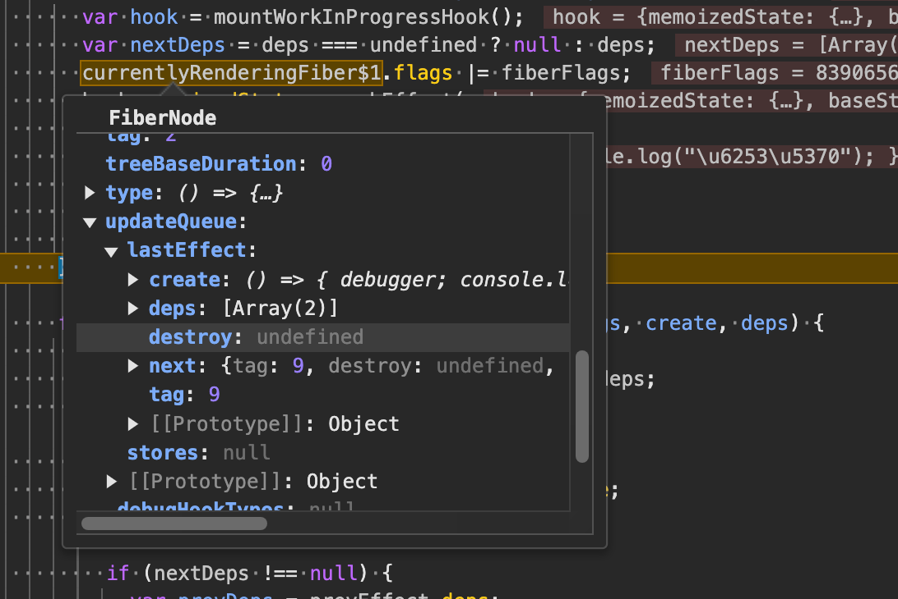

# 初始化阶段

1. 主要是运行了 mountEffectImpl 创建 hook 对象以及创建 effect 数据类型
2. 将创建的 hook 对象和当前 Fiber memoizedState 属性连接，然后将创建的 effect 对象和 hook 的 memoizedState 属性连接，还需要将当前产生的更新放到 fiber 的 updateQueue 中

```js
function mountEffectImpl(fiberFlags, hookFlags, create, deps) {
  var hook = mountWorkInProgressHook();
  var nextDeps = deps === undefined ? null : deps;
  currentlyRenderingFiber$1.flags |= fiberFlags;
  hook.memoizedState = pushEffect(
    HasEffect | hookFlags,
    create,
    undefined,
    nextDeps
  );
}

function mountWorkInProgressHook() {
  var hook = {
    memoizedState: null,
    baseState: null,
    baseQueue: null,
    queue: null,
    next: null,
  };

  if (workInProgressHook === null) {
    // This is the first hook in the list
    currentlyRenderingFiber$1.memoizedState = workInProgressHook = hook;
  } else {
    // Append to the end of the list
    workInProgressHook = workInProgressHook.next = hook;
  }

  return workInProgressHook;
}

function pushEffect(tag, create, destroy, deps) {
  var effect = {
    tag: tag,
    create: create,
    destroy: destroy,
    deps: deps,
    // Circular
    next: null,
  };
  var componentUpdateQueue = currentlyRenderingFiber$1.updateQueue;

  if (componentUpdateQueue === null) {
    componentUpdateQueue = createFunctionComponentUpdateQueue();
    currentlyRenderingFiber$1.updateQueue = componentUpdateQueue;
    componentUpdateQueue.lastEffect = effect.next = effect;
  } else {
    var lastEffect = componentUpdateQueue.lastEffect;

    if (lastEffect === null) {
      componentUpdateQueue.lastEffect = effect.next = effect;
    } else {
      var firstEffect = lastEffect.next;
      lastEffect.next = effect;
      effect.next = firstEffect;
      componentUpdateQueue.lastEffect = effect;
    }
  }

  return effect;
}
```



2. 在 commit 阶段，会运行 flushPassiveEffects();这里会对 useEffect 进行一些特殊的处理
   a. 下面代码可以看出，先是调用 commitPassiveUnmountEffects 对 clearUp 清理函数执行了调用操作，接着调用 commitPassiveMountEffects 开启执行副作用，从下往上依次执行 Effect

```js
function flushPassiveEffectsImpl() {
  // ...

  // 处理卸载函数
  commitPassiveUnmountEffects(root.current);
  // 处理副作用
  commitPassiveMountEffects(root, root.current);

  // ...

  function commitPassiveUnmountEffects() {
    nextEffect = firstChild;
    commitPassiveUnmountEffects_begin();
  }

  function commitPassiveUnmountEffects_begin() {
    while (nextEffect !== null) {
      var fiber = nextEffect;
      var child = fiber.child;

      if ((nextEffect.flags & ChildDeletion) !== NoFlags) {
        var deletions = fiber.deletions;

        if (deletions !== null) {
          for (var i = 0; i < deletions.length; i++) {
            var fiberToDelete = deletions[i];
            nextEffect = fiberToDelete;
            commitPassiveUnmountEffectsInsideOfDeletedTree_begin(
              fiberToDelete,
              fiber
            );
          }

          {
            // A fiber was deleted from this parent fiber, but it's still part of
            // the previous (alternate) parent fiber's list of children. Because
            // children are a linked list, an earlier sibling that's still alive
            // will be connected to the deleted fiber via its `alternate`:
            //
            //   live fiber
            //   --alternate--> previous live fiber
            //   --sibling--> deleted fiber
            //
            // We can't disconnect `alternate` on nodes that haven't been deleted
            // yet, but we can disconnect the `sibling` and `child` pointers.
            var previousFiber = fiber.alternate;

            if (previousFiber !== null) {
              var detachedChild = previousFiber.child;

              if (detachedChild !== null) {
                previousFiber.child = null;

                do {
                  var detachedSibling = detachedChild.sibling;
                  detachedChild.sibling = null;
                  detachedChild = detachedSibling;
                } while (detachedChild !== null);
              }
            }
          }

          nextEffect = fiber;
        }
      }

      if ((fiber.subtreeFlags & PassiveMask) !== NoFlags && child !== null) {
        ensureCorrectReturnPointer(child, fiber);
        nextEffect = child;
      } else {
        commitPassiveUnmountEffects_complete();
      }
    }
  }

  // 依次执行副作用，执行副作用的前提是判断当前 fiber 节点有没有Passive的 flags
  function commitPassiveUnmountEffects_complete() {
    while (nextEffect !== null) {
      var fiber = nextEffect;

      if ((fiber.flags & Passive) !== NoFlags) {
        setCurrentFiber(fiber);
        commitPassiveUnmountOnFiber(fiber);
        resetCurrentFiber();
      }

      var sibling = fiber.sibling;

      if (sibling !== null) {
        ensureCorrectReturnPointer(sibling, fiber.return);
        nextEffect = sibling;
        return;
      }

      nextEffect = fiber.return;
    }
  }

  function commitPassiveUnmountOnFiber(finishedWork) {
    switch (finishedWork.tag) {
      case FunctionComponent:
      case ForwardRef:
      case SimpleMemoComponent: {
        if (finishedWork.mode & ProfileMode) {
          startPassiveEffectTimer();
          commitHookEffectListUnmount(
            Passive$1 | HasEffect,
            finishedWork,
            finishedWork.return
          );
          recordPassiveEffectDuration(finishedWork);
        } else {
          commitHookEffectListUnmount(
            Passive$1 | HasEffect,
            finishedWork,
            finishedWork.return
          );
        }

        break;
      }
    }
  }

  function commitHookEffectListUnmount(
    flags,
    finishedWork,
    nearestMountedAncestor
  ) {
    var updateQueue = finishedWork.updateQueue;
    var lastEffect = updateQueue !== null ? updateQueue.lastEffect : null;

    if (lastEffect !== null) {
      var firstEffect = lastEffect.next;
      var effect = firstEffect;

      do {
        if ((effect.tag & flags) === flags) {
          // Unmount
          var destroy = effect.destroy;
          effect.destroy = undefined;

          if (destroy !== undefined) {
            {
              if ((flags & Passive$1) !== NoFlags$1) {
                markComponentPassiveEffectUnmountStarted(finishedWork);
              } else if ((flags & Layout) !== NoFlags$1) {
                markComponentLayoutEffectUnmountStarted(finishedWork);
              }
            }

            safelyCallDestroy(finishedWork, nearestMountedAncestor, destroy);

            {
              if ((flags & Passive$1) !== NoFlags$1) {
                markComponentPassiveEffectUnmountStopped();
              } else if ((flags & Layout) !== NoFlags$1) {
                markComponentLayoutEffectUnmountStopped();
              }
            }
          }
        }

        effect = effect.next;
      } while (effect !== firstEffect);
    }
  }
}
```
