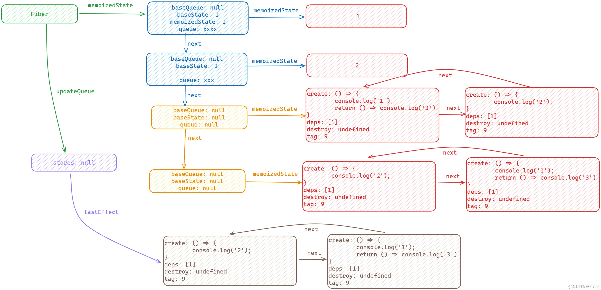

# 初始化的时候

```js
function useState(initialState) {
  var dispatcher = resolveDispatcher();
  return dispatcher.useState(initialState);
}
```

1. 调用 resolveDispatcher 生成一个 dispatcher 实例;从下面的源码可以看出其实就是取了 ReactCurrentDispatcher.current 进行了一个赋值。
   
   实际上其实调用的是 ReactCurrentDispatcher 提供的 useState 函数

```js
function resolveDispatcher() {
  var dispatcher = ReactCurrentDispatcher.current;

  {
    if (dispatcher === null) {
      error(
        "Invalid hook call. Hooks can only be called inside of the body of a function component. This could happen for" +
          " one of the following reasons:\n" +
          "1. You might have mismatching versions of React and the renderer (such as React DOM)\n" +
          "2. You might be breaking the Rules of Hooks\n" +
          "3. You might have more than one copy of React in the same app\n" +
          "See https://reactjs.org/link/invalid-hook-call for tips about how to debug and fix this problem."
      );
    }
  } // Will result in a null access error if accessed outside render phase. We
  // intentionally don't throw our own error because this is in a hot path.
  // Also helps ensure this is inlined.

  return dispatcher;
}
```

2. 通过 dispatcher 的 useState 方法返回一个数组[state,setState]； 内部的话调用的是 mountState

```js
{
    useState: function (initialState) {
          currentHookNameInDev = "useState";
          mountHookTypesDev();
          var prevDispatcher = ReactCurrentDispatcher$1.current;
          ReactCurrentDispatcher$1.current =
            InvalidNestedHooksDispatcherOnMountInDEV;

          try {
            return mountState(initialState);
          } finally {
            ReactCurrentDispatcher$1.current = prevDispatcher;
          }
        },
}
```

这个函数的作用是生成 hook，并把 hook 挂载到 workInProgressFiber 节点上

```js
function mountWorkInProgressHook() {
  var hook = {
    memoizedState: null,
    baseState: null,
    baseQueue: null,
    queue: null,
    next: null,
  };

  if (workInProgressHook === null) {
    // This is the first hook in the list
    currentlyRenderingFiber$1.memoizedState = workInProgressHook = hook;
  } else {
    // Append to the end of the list
    workInProgressHook = workInProgressHook.next = hook;
  }

  return workInProgressHook;
}
```

```js
function mountState(initialState) {
  var hook = mountWorkInProgressHook();

  if (typeof initialState === "function") {
    // $FlowFixMe: Flow doesn't like mixed types
    initialState = initialState();
  }

  hook.memoizedState = hook.baseState = initialState;
  var queue = {
    pending: null,
    interleaved: null,
    lanes: NoLanes,
    dispatch: null,
    lastRenderedReducer: basicStateReducer,
    lastRenderedState: initialState,
  };
  hook.queue = queue;
  var dispatch = (queue.dispatch = dispatchSetState.bind(
    null,
    currentlyRenderingFiber$1,
    queue
  ));
  return [hook.memoizedState, dispatch];
}
```

1. 先创建一个 hook 对象
2. 创建一个 queue 对象
3. 将 hook.queue 赋值为创建的 queue 对象
4. 创建一个 dispatch，将 dispatch 赋值为 dispatchSetState
5. 最后通过一个数组返回

# 触发更新阶段

```js
do {
  var updateLane = update.lane;

  if (!isSubsetOfLanes(renderLanes, updateLane)) {
    // Priority is insufficient. Skip this update. If this is the first
    // skipped update, the previous update/state is the new base
    // update/state.
    var clone = {
      lane: updateLane,
      action: update.action,
      hasEagerState: update.hasEagerState,
      eagerState: update.eagerState,
      next: null,
    };

    if (newBaseQueueLast === null) {
      newBaseQueueFirst = newBaseQueueLast = clone;
      newBaseState = newState;
    } else {
      newBaseQueueLast = newBaseQueueLast.next = clone;
    } // Update the remaining priority in the queue.
    // TODO: Don't need to accumulate this. Instead, we can remove
    // renderLanes from the original lanes.

    currentlyRenderingFiber$1.lanes = mergeLanes(
      currentlyRenderingFiber$1.lanes,
      updateLane
    );
    markSkippedUpdateLanes(updateLane);
  } else {
    // This update does have sufficient priority.
    if (newBaseQueueLast !== null) {
      var _clone = {
        // This update is going to be committed so we never want uncommit
        // it. Using NoLane works because 0 is a subset of all bitmasks, so
        // this will never be skipped by the check above.
        lane: NoLane,
        action: update.action,
        hasEagerState: update.hasEagerState,
        eagerState: update.eagerState,
        next: null,
      };
      newBaseQueueLast = newBaseQueueLast.next = _clone;
    } // Process this update.

    if (update.hasEagerState) {
      // If this update is a state update (not a reducer) and was processed eagerly,
      // we can use the eagerly computed state
      newState = update.eagerState;
    } else {
      var action = update.action;
      newState = reducer(newState, action);
    }
  }

  update = update.next;
} while (update !== null && update !== first);
```

1. 先会创建一个 update 数据结构
2. 触发调度器进行调度
3. 通过 renderWithHooks
4. 重新执行组件方法
5. useState 为新的，会调用更新阶段的 updateState 方法进行更新。
6. updateState 内部会遍历链表，通过 Object.is 进行浅比较，打标，然后返回最新的[state,setState]
7. 走触发更新的流程

最后构成的数据结构如图:


来看一下这个原理

```js
function updateReducer(reducer, initialArg, init) {
  // 拿到当前的 hook 对象，该对象可能是根据current树 hook 生成的。也可能是直接复用的。
  var hook = updateWorkInProgressHook();
  var queue = hook.queue;

  if (queue === null) {
    throw new Error(
      "Should have a queue. This is likely a bug in React. Please file an issue."
    );
  }

  queue.lastRenderedReducer = reducer;
  var current = currentHook; // The last rebase update that is NOT part of the base state.

  var baseQueue = current.baseQueue; // The last pending update that hasn't been processed yet.

  var pendingQueue = queue.pending;

  if (pendingQueue !== null) {
    // We have new updates that haven't been processed yet.
    // We'll add them to the base queue.
    if (baseQueue !== null) {
      // Merge the pending queue and the base queue.

      // 将baseQueue和pendingQueue连接起来
      var baseFirst = baseQueue.next;
      var pendingFirst = pendingQueue.next;
      baseQueue.next = pendingFirst;
      pendingQueue.next = baseFirst;
    }

    {
      if (current.baseQueue !== baseQueue) {
        // Internal invariant that should never happen, but feasibly could in
        // the future if we implement resuming, or some form of that.
        error(
          "Internal error: Expected work-in-progress queue to be a clone. " +
            "This is a bug in React."
        );
      }
    }

    // 如果 baseQueue 为空，将pendingQueue赋值给baseQueue
    current.baseQueue = baseQueue = pendingQueue;
    queue.pending = null;
  }

  if (baseQueue !== null) {
    // We have a queue to process.
    var first = baseQueue.next;
    var newState = current.baseState;
    var newBaseState = null;
    var newBaseQueueFirst = null;
    var newBaseQueueLast = null;
    var update = first;

    do {
      var updateLane = update.lane;

      if (!isSubsetOfLanes(renderLanes, updateLane)) {
        // Priority is insufficient. Skip this update. If this is the first
        // skipped update, the previous update/state is the new base
        // update/state.
        var clone = {
          lane: updateLane,
          action: update.action,
          hasEagerState: update.hasEagerState,
          eagerState: update.eagerState,
          next: null,
        };

        if (newBaseQueueLast === null) {
          newBaseQueueFirst = newBaseQueueLast = clone;
          newBaseState = newState;
        } else {
          newBaseQueueLast = newBaseQueueLast.next = clone;
        } // Update the remaining priority in the queue.
        // TODO: Don't need to accumulate this. Instead, we can remove
        // renderLanes from the original lanes.

        currentlyRenderingFiber$1.lanes = mergeLanes(
          currentlyRenderingFiber$1.lanes,
          updateLane
        );
        markSkippedUpdateLanes(updateLane);
      } else {
        // This update does have sufficient priority.
        if (newBaseQueueLast !== null) {
          var _clone = {
            // This update is going to be committed so we never want uncommit
            // it. Using NoLane works because 0 is a subset of all bitmasks, so
            // this will never be skipped by the check above.
            lane: NoLane,
            action: update.action,
            hasEagerState: update.hasEagerState,
            eagerState: update.eagerState,
            next: null,
          };
          newBaseQueueLast = newBaseQueueLast.next = _clone;
        } // Process this update.

        if (update.hasEagerState) {
          // If this update is a state update (not a reducer) and was processed eagerly,
          // we can use the eagerly computed state
          newState = update.eagerState;
        } else {
          var action = update.action;
          newState = reducer(newState, action);
        }
      }

      update = update.next;
    } while (update !== null && update !== first);

    if (newBaseQueueLast === null) {
      newBaseState = newState;
    } else {
      newBaseQueueLast.next = newBaseQueueFirst;
    } // Mark that the fiber performed work, but only if the new state is
    // different from the current state.

    // 比较前后的 State，一致的话设置ReceivedUpdate，后续会进入 Bailout 策略
    if (!objectIs(newState, hook.memoizedState)) {
      markWorkInProgressReceivedUpdate();
    }

    hook.memoizedState = newState;
    hook.baseState = newBaseState;
    hook.baseQueue = newBaseQueueLast;
    queue.lastRenderedState = newState;
  } // Interleaved updates are stored on a separate queue. We aren't going to
  // process them during this render, but we do need to track which lanes
  // are remaining.

  var lastInterleaved = queue.interleaved;

  if (lastInterleaved !== null) {
    var interleaved = lastInterleaved;

    do {
      var interleavedLane = interleaved.lane;
      currentlyRenderingFiber$1.lanes = mergeLanes(
        currentlyRenderingFiber$1.lanes,
        interleavedLane
      );
      markSkippedUpdateLanes(interleavedLane);
      interleaved = interleaved.next;
    } while (interleaved !== lastInterleaved);
  } else if (baseQueue === null) {
    // `queue.lanes` is used for entangling transitions. We can set it back to
    // zero once the queue is empty.
    queue.lanes = NoLanes;
  }

  var dispatch = queue.dispatch;
  return [hook.memoizedState, dispatch];
}
```


最后放一张镇宅图


可以看到 Fiber 通过 memoizedState 对 hook 对象进行了连接，hook 对象内部有一个 memoizedState 指向 useEffet 生成的副作用函数或计算出的 state
